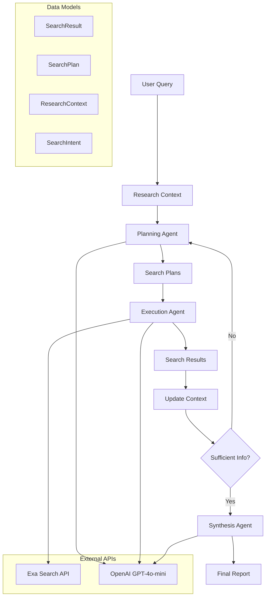
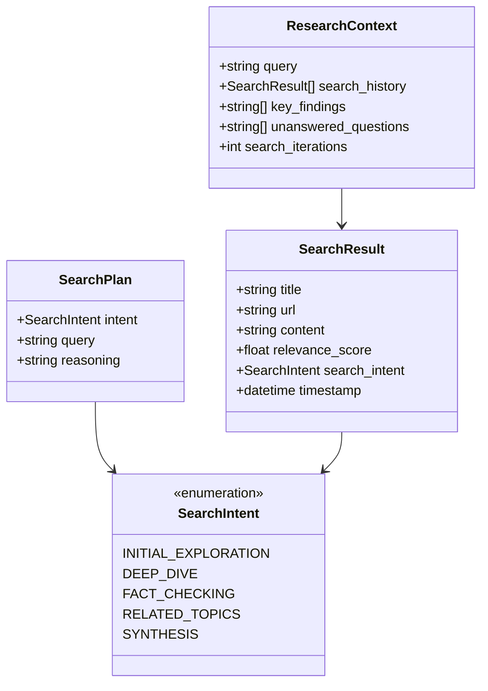
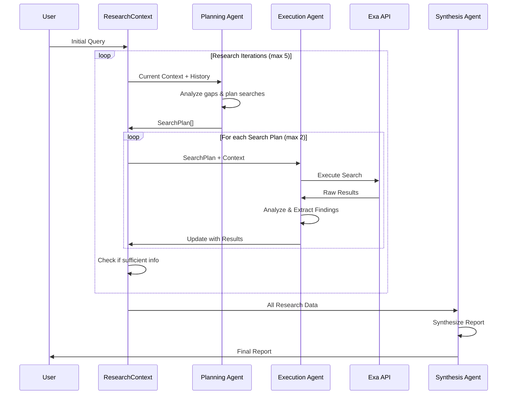

# Fullstack Search Agent

A sophisticated AI-powered research platform featuring a **Deep Research Agent** that conducts strategic, multi-iteration searches to provide comprehensive research reports. The system combines multiple LLM providers with advanced web search capabilities for real-time research assistance.

## Features

- **Deep Research Agent**: Multi-agent orchestration with strategic planning, execution, and synthesis
- **Multi-LLM Support**: Google Gemini, Anthropic Claude, and OpenAI GPT
- **Advanced Web Search**: Exa API integration with autoprompt optimization
- **Context-Aware Planning**: Each search iteration considers previous findings
- **Strategic Search Intents**: Five search types for comprehensive coverage
- **Real-time Streaming**: Live search progress via Server-Sent Events
- **Interactive UI**: Clean Next.js interface with TypeScript
- **Observability**: Full tracing with Lilypad integration

## Tech Stack

**Backend:**
- FastAPI (Python web framework)
- Mirascope (LLM orchestration)
- Exa API (Advanced web search)
- Lilypad (Tracing and observability)
- UV (Python package manager)
- Pydantic (Data validation)

**Frontend:**
- Next.js 15 with App Router
- React 19
- TypeScript
- Tailwind CSS 4

## Setup Instructions

### Prerequisites

- **Python 3.11+**
- **Node.js 18+**
- **UV** (Python package manager) - [Install UV](https://docs.astral.sh/uv/getting-started/installation/)

### 1. Clone Repository

```bash
git clone https://github.com/your-username/fullstack-search-agent.git
cd fullstack-search-agent
```

### 2. Backend Setup

```bash
cd backend

# Install dependencies with UV
uv sync

# Create environment file
cp .env.example .env  # or create .env manually
```

Configure your API keys in `backend/.env`:

```env
GOOGLE_API_KEY=your_google_api_key_here
ANTHROPIC_API_KEY=your_anthropic_api_key_here
EXA_API_KEY=your_exa_api_key_here
OPENAI_API_KEY=your_openai_api_key_here
```

### 3. Frontend Setup

```bash
cd ../frontend

# Install dependencies
npm install
```

### 4. API Key Setup

#### Required API Keys:

1. **Google Gemini API**: 
   - Get your key from [Google AI Studio](https://aistudio.google.com/app/apikey)

2. **Anthropic Claude API**: 
   - Get your key from [Anthropic Console](https://console.anthropic.com/)

3. **Exa API**: 
   - Get your key from [Exa API](https://dashboard.exa.ai/)

4. **OpenAI API** (optional): 
   - Get your key from [OpenAI Platform](https://platform.openai.com/)

## Running the Application

### Development Mode

1. **Start the backend server:**
   ```bash
   cd backend
   uv run uvicorn main:app --reload --port 8000
   ```

2. **Start the frontend development server:**
   ```bash
   cd frontend
   npm run dev
   ```

3. **Access the application:**
   - Frontend: http://localhost:3000
   - Backend API: http://localhost:8000
   - API Documentation: http://localhost:8000/docs

### Production Mode

1. **Build the frontend:**
   ```bash
   cd frontend
   npm run build
   ```

2. **Start production servers:**
   ```bash
   # Backend
   cd backend
   uv run uvicorn main:app --host 0.0.0.0 --port 8000

   # Frontend
   cd frontend
   npm start
   ```

## Development

### Backend Development

The backend uses Jupyter notebooks for interactive development:

```bash
cd backend
# Start Marimo notebook server
uv run marimo edit agent.ipynb
```

### Frontend Development

```bash
cd frontend
# Run development server with Turbopack
npm run dev

# Run linting
npm run lint
```

## Deep Research Agent Architecture

The core of this system is a sophisticated research agent that uses multi-agent orchestration:

### System Architecture



### Core Data Models



### Agent Flow



### Three Specialized Agents

1. **Planning Agent** (`plan_searches`): Analyzes research context and plans strategic searches
2. **Execution Agent** (`execute_search`): Executes searches and extracts findings
3. **Synthesis Agent** (`synthesize_research`): Creates comprehensive final reports

### Usage

```python
from src.agent import run_deep_research_agent

result = run_deep_research_agent(
    "Your research question here",
    max_iterations=5
)

print(result['final_report'])
```

## API Endpoints

- `GET /` - Health check
- `POST /search` - Streaming search endpoint  
- `GET /docs` - API documentation

## Contributing

1. Fork the repository
2. Create a feature branch
3. Make your changes
4. Run tests and linting
5. Submit a pull request

## License

This project is licensed under the MIT License - see the LICENSE file for details.