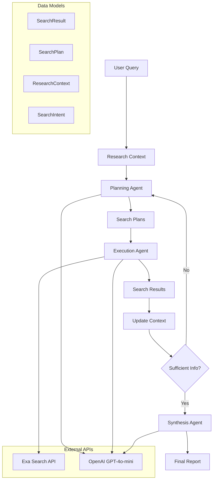
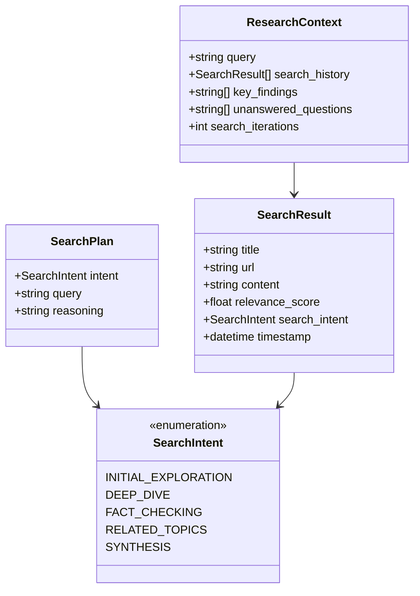
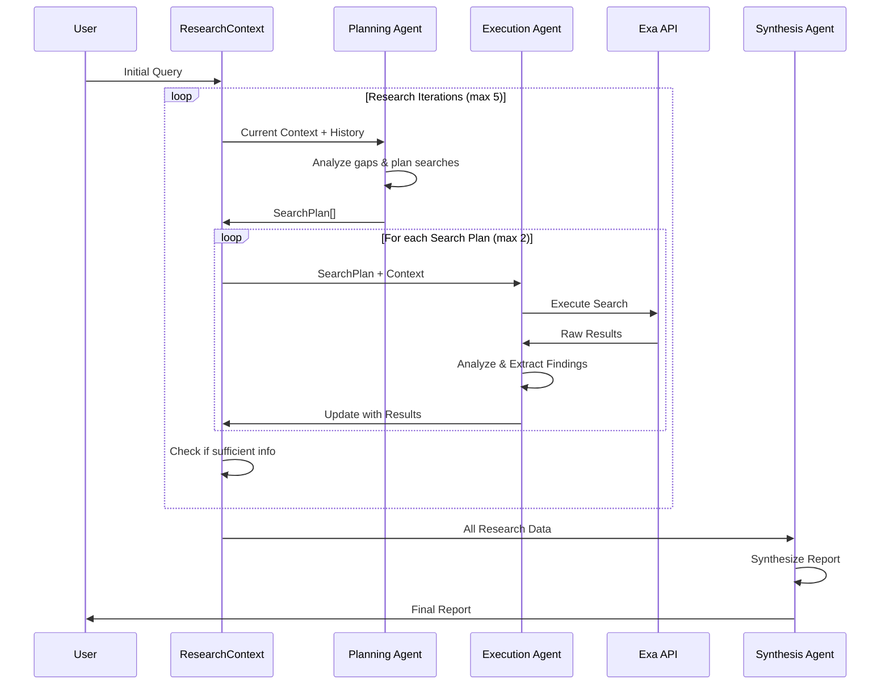
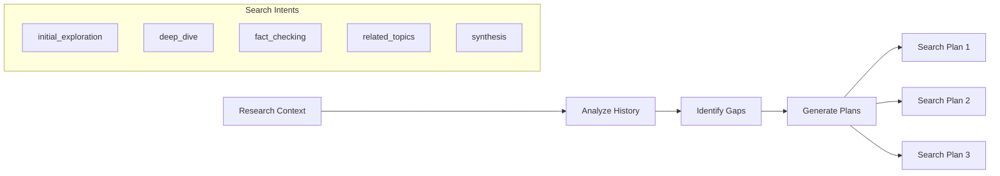

# Deep Research Agent

A sophisticated web research agent that conducts strategic, multi-iteration searches to provide comprehensive research reports.

## System Architecture

The agent uses a multi-agent orchestration pattern with three specialized LLM agents working together:



## Component Deep Dive

### Core Data Models

The system is built around four key data structures:



### Agent Flow

The research process follows this sequence:



## Agent Orchestration Details

### Planning Agent (`plan_searches`)
**Function**: Strategic search planning based on research context
**Input**: `ResearchContext` with history and findings
**Output**: List of `SearchPlan` objects
**Key Logic**:
- Analyzes last 5 search results for context
- Identifies knowledge gaps and unanswered questions
- Plans up to 3 strategic searches per iteration
- Each plan includes intent, optimized query, and reasoning



### Execution Agent (`execute_search`)
**Function**: Execute searches and analyze results in context
**Input**: `SearchPlan` + `ResearchContext`
**Output**: Analyzed search results with extracted findings
**Key Logic**:
- Calls `get_search_results()` tool function
- Analyzes results against research context
- Extracts key findings and remaining questions
- Updates search intent for each result

### Synthesis Agent (`synthesize_research`)
**Function**: Create comprehensive final report
**Input**: Complete `ResearchContext` with all findings
**Output**: Structured research report
**Key Logic**:
- Combines all search history and findings
- Creates executive summary
- Provides evidence-based conclusions
- Identifies research limitations

## Key Implementation Details

### Search Function (`get_search_results`)
- **API**: Exa search with autoprompt optimization
- **Result Processing**: Structured data with relevance scoring
- **Content Limiting**: 2000 chars per result to manage context
- **Error Handling**: Graceful fallback on API failures

### Main Orchestrator (`run_deep_research_agent`)
**Control Flow**:
1. Initialize `ResearchContext` with user query
2. Iterative research loop (max 5 iterations):
   - Generate search plans via Planning Agent
   - Execute up to 2 searches per iteration
   - Update context with results and findings
   - Check termination conditions
3. Synthesize final report via Synthesis Agent

**Termination Conditions**:
- Max iterations reached (5)
- Sufficient findings gathered (≥5 key findings + ≥3 iterations)
- Planning errors prevent continuation

### State Management
The `ResearchContext` acts as the central state store:
- Accumulates search history across iterations  
- Tracks key findings and unanswered questions
- Maintains iteration count for planning decisions
- Provides context for strategic search planning

## Features

- **Context-Aware Planning**: Each search iteration considers previous findings
- **Strategic Search Intents**: Different search types for comprehensive coverage
- **Relevance Scoring**: Results ranked by position and relevance
- **Error Handling**: Robust error management for search failures
- **Trace Logging**: Full observability with Lilypad tracing
- **Configurable Limits**: Adjustable iteration limits and result counts

## Dependencies

- **Exa API**: Primary search engine
- **Mirascope**: LLM interaction framework
- **Lilypad**: Tracing and observability
- **Google Gemini**: LLM provider for planning and synthesis
- **Pydantic**: Data validation and modeling

## Usage

```python
from src.agent import run_deep_research_agent

result = run_deep_research_agent(
    "Your research question here",
    max_iterations=5
)

print(result['final_report'])
```

The agent returns a dictionary containing:
- `final_report`: Comprehensive research report
- `research_context`: Complete research history and findings
- `iterations`: Number of search iterations performed